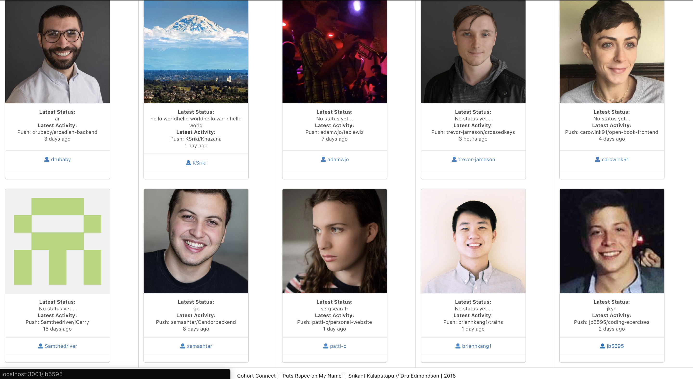
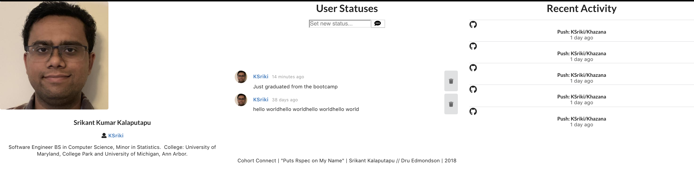

# CohortConnect

<b>A digital bulletin board for students in the same coding class based on real-time GitHub API data</b>

This application was created to allow students in our cohort to view each others github activity. It allows users to also have "Statuses" kind of like writing on a blackboard. This project was made for our mod 4 project in order to further our understanding of React. Implements React-Router and Semantic-UI.

## Tech/framework used

This is a Single-Page Application.

<b>Built with</b>
- [React](https://reactjs.org/)
- [Ruby on Rails](https://rubyonrails.org/)
- [Semantic UI](https://react.semantic-ui.com/)
- [Github API](https://developer.github.com/v3/)

## Features

- Allows students in the same coding class to view basic Github information of other students.
- Allows students to view each others latest Git Event activity.
- Allows students to write on their own personal "Blackboard" page of what they are up to.
- Allows students to delete statuses on their blackboard.

## Possible future features

- User Authentication

## Collaborators
- [@KSriki](https://github.com/KSriki)
- [@drubaby](https://github.com/drubaby/)

## How to use

[BackEnd](https://github.com/KSriki/CohortConnectBackend) requires Ruby and Bundler . 
FrontEnd requires Git and Node Package Manager

In Terminal/Console:

```
 # Clone the repos into the same folder
 $ git clone git@github.com:KSriki/CohortConnectFrontEnd.git
 $ git clone git@github.com:KSriki/CohortConnectBackend.git
 

 # navigate to backend
 $ cd CohortConnectBackend
 
 # setup backend
 $ bundle install
 
 # create the database
 $ rails db:create
 
 # migrate the database (add tables etc.)
 $ rails db:migrate

 # seed the database with base data
 $ rails db:seed

 # run the server
 $ rails s
 
 ## In another terminal window set up front end
 $ cd CohortConnectFrontEnd
 
 # Install the packages
 $ npm install
 
 # start the server
 $ npm start
 
 # Type and enter 'yes' when asked for different port (3000 is taken by the backend)
 
```
## Screenshots

| Homepage  | UserBoard | 
| ------------- | ------------- | 
|    |   | 


